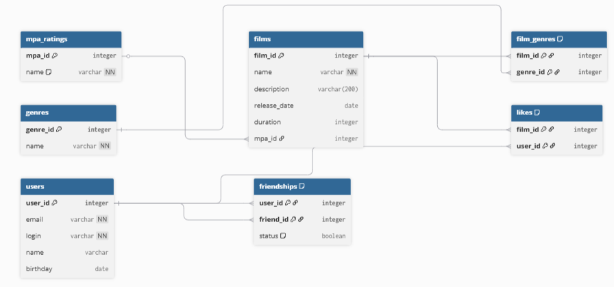

## Проектирование базы данных

Для проекта Filmorate была разработана реляционная схема базы данных.



### Основные таблицы:
- **users**: информация о пользователях.
- **friendships**: статусы дружбы между пользователями (подтвержденная/неподтвержденная).
- **films**: данные о фильмах и их связи с рейтингами MPA.
- **mpa_ratings**: справочник возрастных ограничений.
- **genres**: справочник жанров.
- **film_genres**: связующая таблица для жанров фильма.
- **likes**: таблица отметок «мне нравится».

### Примеры SQL-запросов:
* **Получение всех друзей пользователя с ID = 1:**
  ```sql
  SELECT u.* FROM users AS u
  JOIN friendships AS f ON u.user_id = f.friend_id
  WHERE f.user_id = 1 AND f.status = true;
  
* **Получение всех фильмов с их рейтингом MPA:**  
  ```sql
  SELECT f.name, m.name AS mpa_rating
  FROM films AS f
  JOIN mpa_ratings AS m ON f.mpa_id = m.mpa_id;

* **Список всех жанров конкретного фильма (ID = 2)**  
  ```sql
  SELECT g.name
  FROM genres AS g
  JOIN film_genres AS fg ON g.genre_id = fg.genre_id
  WHERE fg.film_id = 2;

* **Поиск общих друзей для пользователей с ID=1 и ID=2:**    
  ```sql
  SELECT u.*
  FROM users u
  JOIN friendships f1 ON u.user_id = f1.friend_id
  JOIN friendships f2 ON u.user_id = f2.friend_id
  WHERE f1.user_id = 1 AND f2.user_id = 2;

* **Вывод всех неподтвержденных заявок в друзья для пользователя (ID = 3):**    
  ```sql
  SELECT u.*
  FROM users AS u
  JOIN friendships AS f ON u.user_id = f.user_id
  WHERE f.friend_id = 3 AND f.status = false;
  
* **Получение названий самых популярных жанров (топ-3)**  
  ```sql
  SELECT g.name, COUNT(fg.film_id) AS genre_count
  FROM genres AS g
  JOIN film_genres AS fg ON g.genre_id = fg.genre_id
  GROUP BY g.genre_id
  ORDER BY genre_count DESC
  LIMIT 3;

* **Список пользователей, которые не поставили ни одного лайка:**    
  ```sql
  SELECT name FROM users
  WHERE user_id NOT IN (SELECT DISTINCT user_id FROM likes);

* **Количество лайков у конкретного фильма (ID = 10):**  
  ```sql
  SELECT COUNT(user_id) AS total_likes
  FROM likes
  WHERE film_id = 10;

* **Все фильмы, вышедшие после 2020 года с рейтингом 'G':**  
  ```sql
  SELECT f.name, f.release_date
  FROM films AS f
  JOIN mpa_ratings AS m ON f.mpa_id = m.mpa_id
  WHERE f.release_date > '2020-01-01' AND m.name = 'G';

* **Пользователи с самым большим количеством друзей:**  
  ```sql
  SELECT u.name, COUNT(f.friend_id) AS friends_count
  FROM users AS u
  JOIN friendships AS f ON u.user_id = f.user_id
  WHERE f.status = true
  GROUP BY u.user_id
  ORDER BY friends_count DESC;
  
* **Обновление статуса дружбы (подтверждение заявки от ID=1 к ID=2):**  
  ```sql
  UPDATE friendships SET status = true
  WHERE user_id = 1 AND friend_id = 2;